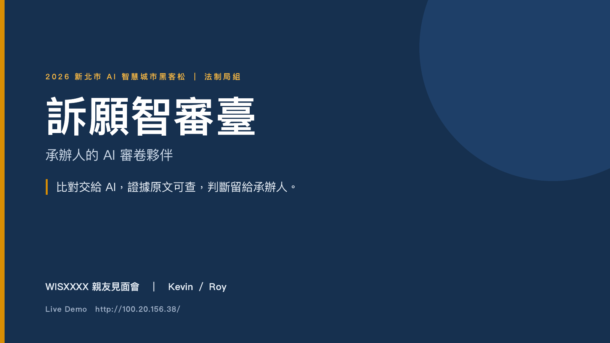
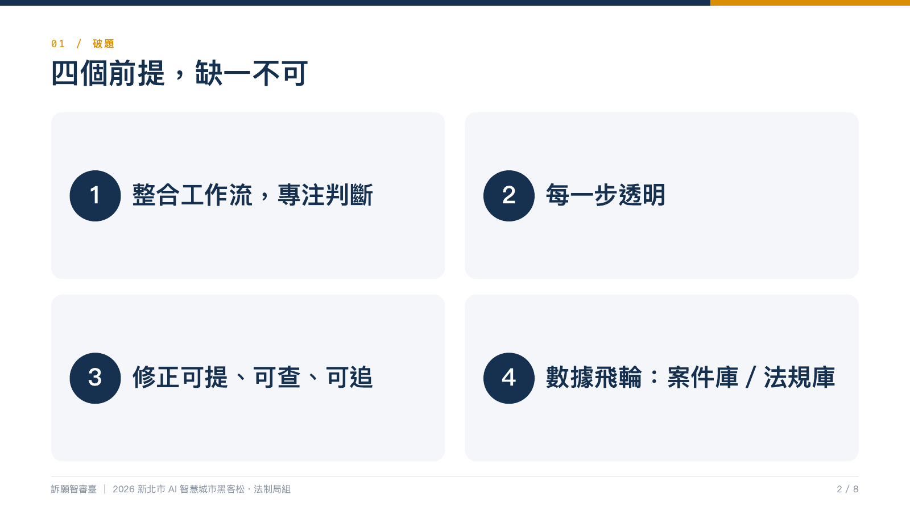
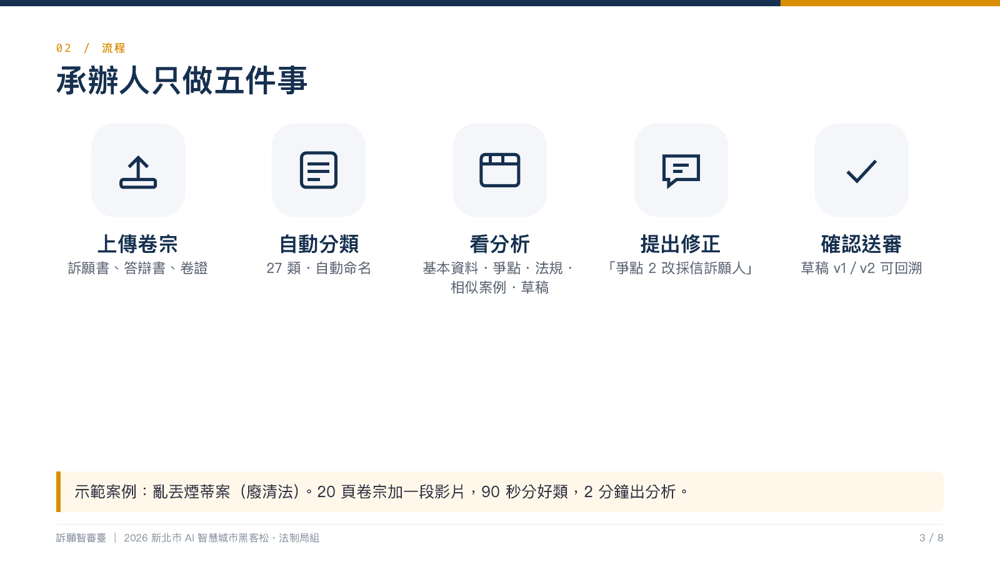
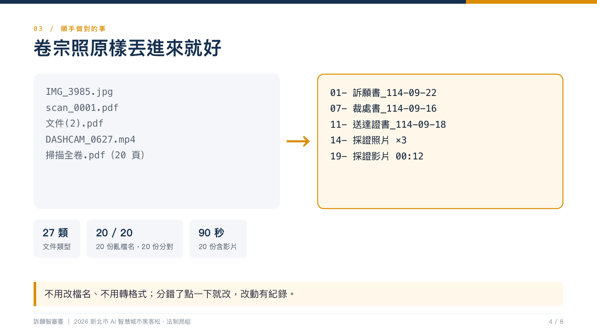
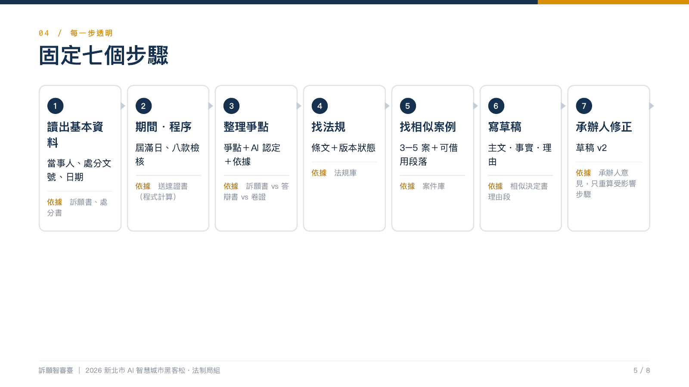
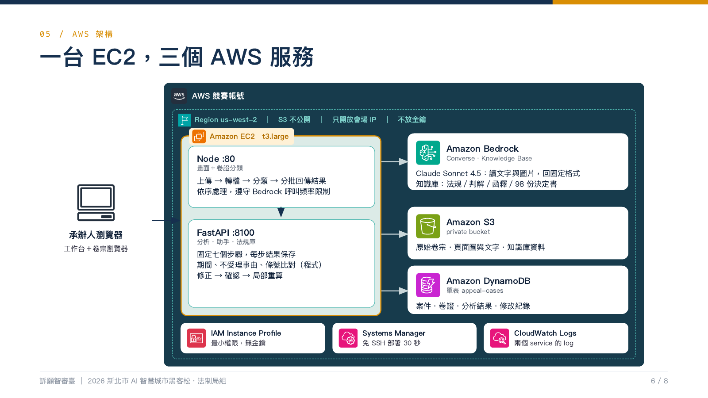
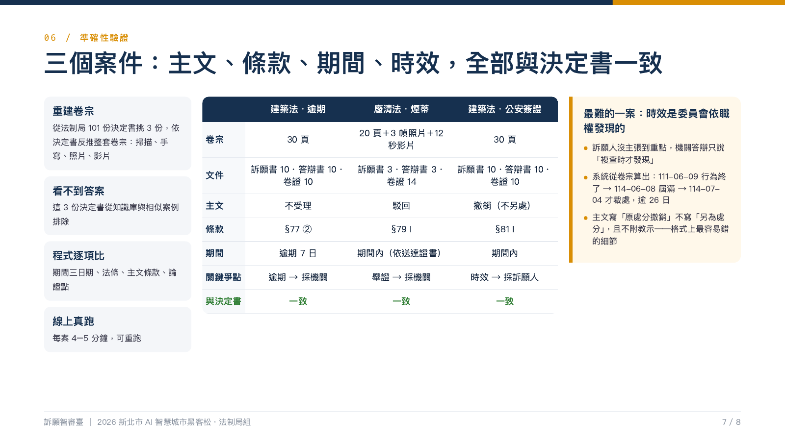

# 訴願智審臺 — 承辦人的 AI 審卷夥伴

> 2026 新北市 AI 智慧城市黑客松・法制局組｜WISXXXX 親友見面會（Kevin／Roy）
>
> **比對交給 AI，證據留給眼睛，判斷留給承辦人。**

- 🌐 Live Demo：<http://100.20.156.38/>（Security Group 僅開放會場公告 IP 與開發者 IP）
- 📑 提案簡報：[`docs/提案/提案簡報-訴願智審臺.pdf`](docs/提案/提案簡報-訴願智審臺.pdf)（[pptx](docs/提案/提案簡報-訴願智審臺.pptx)）
- 🎤 6 分鐘講稿（含 Demo 腳本）：[`docs/提案/講稿-6分鐘含Demo.md`](docs/提案/講稿-6分鐘含Demo.md)
- 📊 準確性驗證：[`docs/評測結果-三案對照標準答案.md`](docs/評測結果-三案對照標準答案.md)

---

## 提案大綱

承辦人只需將訴願書、答辯書與卷證**原樣上傳**，系統以 Amazon Bedrock（Claude Sonnet 4.5）自動辨識 27 類文件並命名，再執行**固定七步驟**：讀基本資料、程式計算期間與不受理事由、整理爭點並標示依據、比對法規庫條文版本、檢索相似案例、產出決定書草稿；每項結論皆可點回原始卷證與條文。承辦人不同意時，對 AI 助理說一句話即產生修正提案，確認後只重算受影響步驟，草稿留版本可回溯，可匯出 ODF 公文。架構為一台 EC2 搭配 Bedrock、S3、DynamoDB，最小權限、不存金鑰。以三份真實決定書反推卷宗驗證，主文、條款、期間、時效全數一致。

---

## 簡報

### 1. 封面



### 2. 破題：四個前提，缺一不可

整合工作流、每一步透明、修正可提可查可追、數據飛輪（案件庫／法規庫）——訪談承辦人後歸納出的設計骨架。



### 3. 流程：承辦人只做五件事

上傳卷宗 → 自動分類（27 類、自動命名）→ 看分析 → 提出修正（「爭點 2 改採信訴願人」）→ 確認送審（草稿 v1／v2 可回溯）。
示範案例：亂丟煙蒂案，20 頁卷宗加一段影片，90 秒分好類，2 分鐘出分析。



### 4. 順手做到的事：卷宗照原樣丟進來

`IMG_3985.jpg`、`scan_0001.pdf`、`文件(2).pdf`、行車紀錄器 mp4、20 頁掃描全卷 → `01-訴願書_114-09-22`、`07-裁處書`、`11-送達證書`、`14-採證照片 ×3`、`19-採證影片 00:12`。日期從內容讀，不看檔名；不用改檔名、不用轉格式，分錯了點一下就改。



### 5. 每一步透明：固定七個步驟

| 步驟 | 產出 | 依據 |
|---|---|---|
| 1 讀出基本資料 | 當事人、處分文號、日期 | 訴願書、處分書 |
| 2 期間・程序 | 屆滿日、八款檢核（**程式計算，非 AI 推測**） | 送達證書 |
| 3 整理爭點 | 爭點＋AI 認定＋依據 | 訴願書 vs 答辯書 vs 卷證 |
| 4 找法規 | 條文＋版本狀態 | 法規庫 |
| 5 找相似案例 | 3–5 案＋可借用段落 | 案件庫 |
| 6 寫草稿 | 主文・事實・理由 | 相似決定書理由段 |
| 7 承辦人修正 | 草稿 v2 | 承辦人意見，只重算受影響步驟 |



### 6. AWS 架構：一台 EC2，三個 AWS 服務



```
瀏覽器 ──HTTP:80──► EC2 t3.large（us-west-2）
                     ├─ Node :80      server/       畫面＋卷宗分類（上傳→轉檔→分類→分批回傳）
                     └─ FastAPI :8100 experiments/  七步分析・AI 助理・法規庫（經 analysis-proxy 反代）
                            │
                            ├─ Amazon Bedrock   Claude Sonnet 4.5（Converse）＋ Knowledge Base（法規／判解／函釋／98 份決定書）
                            ├─ Amazon S3        私有 bucket：原始卷宗、頁面圖與文字、知識庫資料
                            └─ Amazon DynamoDB  單表 appeal-cases：案件、卷證、分析結果、修改紀錄
```

IAM Instance Profile 最小權限、不放金鑰；Systems Manager 免 SSH 部署約 30 秒；兩個 service 的 log 進 CloudWatch Logs。

### 7. 準確性驗證：三個案件全部與決定書一致

從法制局 101 份決定書挑 3 份（不受理／駁回／撤銷各一）**反推出完整卷宗**（掃描、手寫、照片、影片共 30 頁），這 3 份決定書**從知識庫與相似案例排除**，再由程式逐項比對。

| | 建築法・逾期 | 廢清法・煙蒂 | 建築法・公安簽證 |
|---|---|---|---|
| 主文 | 不受理 | 駁回 | 撤銷（不另處） |
| 條款 | §77 ② | §79 I | §81 I |
| 期間 | 逾期 7 日 | 期間內（依送達證書） | 期間內 |
| 關鍵爭點 | 逾期 → 採機關 | 舉證 → 採機關 | **時效 → 採訴願人** |
| 與決定書 | 一致 | 一致 | 一致 |

最難的一案：裁處權時效是委員會依職權發現的，訴願人沒主張到重點；系統從卷宗算出 111-06-09 行為終了 → 114-06-08 屆滿 → 114-07-04 才裁處，逾 26 日，主文寫「原處分撤銷」且不附教示。理由段涵蓋標準答案 18／21 個論證點。



### 8. 感謝聆聽


---

## 專案結構

```
prototype/        前端（純 HTML/JS，hash router；index.html / app.js / api.js / data.js / odf.js）
  tests/          gstack headless 驗證（助手卡片、問／改意圖、IME Enter）
server/           Node 20：卷宗歸戶（上傳→正規化→Bedrock 分類）、S3／DynamoDB、靜態前端、analysis-proxy
experiments/      Python：七步分析 pipeline、AI 助理、法規庫、FastAPI :8100
  pipeline/       common（Bedrock 節流／tool-use JSON／串流／圖片）、run_all、objection、assistant、to_frontend
  prompts/        每步一個 .md（s1–s6、assistant、system）
  tests/          pytest：助手單元／對話／API（零 LLM）＋ LIVE 測試
  eval/           compare_truth.py：三案對照標準答案
deploy/           EC2 建置、node／analysis 兩套 push→S3→SSM redeploy、logs.sh
docs/             命題文件、API 文件、提案簡報與講稿、評測結果
plans/            各版 prototype 確認清單、API 契約、上線驗收
資料集/           命題方提供（101 決定書／法規／判解／函釋）、自行蒐集、評測用（勿用於 RAG）
```

## 本機開發

### 前端＋歸戶（Node）

```bash
cd server && npm ci
cp .env.example .env      # S3_BUCKET、DDB_TABLE 必填；AWS_PROFILE 本機用
npm start                 # :8080，同時靜態提供 ../prototype
npm test                  # 正規化 35 案，零 LLM
```

### 分析／助理／法規庫（Python）

```bash
cd experiments
python3 -m venv .venv && .venv/bin/pip install -r requirements.txt -r requirements-dev.txt
export AWS_PROFILE=ntpc-hackathon AWS_REGION=us-west-2
.venv/bin/uvicorn api:app --port 8100                       # Node 端 ANALYSIS_URL 指到這裡
.venv/bin/python -m pytest tests -q                          # 助手單元＋對話＋API，零 LLM
LIVE=1 .venv/bin/python -m pytest tests/test_assistant_live.py -q   # 真打 Bedrock
.venv/bin/python eval/compare_truth.py                       # 三案對照標準答案
```

### 前端 E2E（gstack headless）

```bash
prototype/tests/chat-cards.spec.sh && prototype/tests/intent.spec.sh && prototype/tests/ime.spec.sh
```

## 部署

```bash
./deploy/node/push.sh        # server/＋prototype/ → S3 → SSM 重啟 app.service
./deploy/analysis/push.sh    # experiments/ → S3 → SSM 重啟 analysis.service
./deploy/logs.sh             # /var/log/ntpc/app-node.log、analysis.log
```

詳見 [`deploy/README.md`](deploy/README.md)。AWS profile `ntpc-hackathon`（暫時憑證），Region `us-west-2`。

## 競賽環境限制

- Region 僅限 `us-east-1`／`us-west-2`；Bedrock ≤ 1 RPS，pipeline 全域鎖序列化
- 純 prompt＋RAG，不訓練模型；EC2 一般機型、無 GPU
- 模型：`us.anthropic.claude-sonnet-4-5-20250929-v1:0`；embedding `cohere.embed-multilingual-v3`

## 資料集使用原則

`資料集/命題方提供/`＋`資料集/自行蒐集/` 只做知識庫原料、few-shot、開發測試。
**`資料集/評測用（勿用於RAG）/` 內的 3 案絕不進知識庫、不當 few-shot、不寫死規則**；知識庫建置腳本不掃該資料夾，評測走與正式流程相同路徑。

## 公開 repo 注意事項

- `.env`、AWS access key、任何憑證檔**絕不進 repo**（已在 `.gitignore`）
- Model ID、Region、套件依賴正常進 repo
- S3 bucket 私有、SG 僅開白名單 IP、EC2 走 Instance Profile

## 相關文件

| 文件 | 內容 |
|---|---|
| [docs/API-文件歸戶.md](docs/API-文件歸戶.md) | 上傳／分類／歸戶 API |
| [docs/API-分析階段.md](docs/API-分析階段.md) | 七步分析、助理、提案 API |
| [plans/助手API-契約與實作清單.md](plans/助手API-契約與實作清單.md) | 助理 chat／proposals 契約、items schema、測試 |
| [plans/上線驗收-2026-09-13.md](plans/上線驗收-2026-09-13.md) | 上線 15 項功能驗收、修正紀錄 |
| [docs/提案/提案大綱.md](docs/提案/提案大綱.md) | 300 字中文／200 字英文大綱 |
